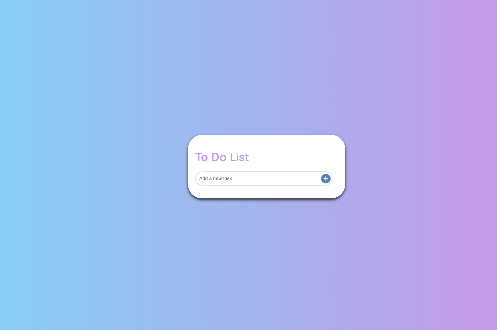
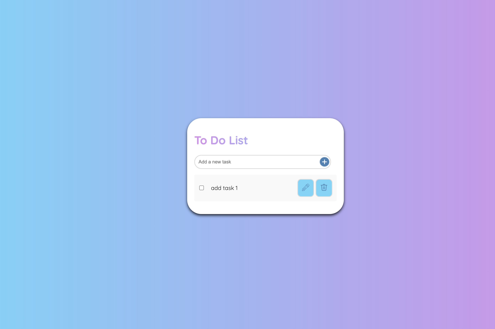
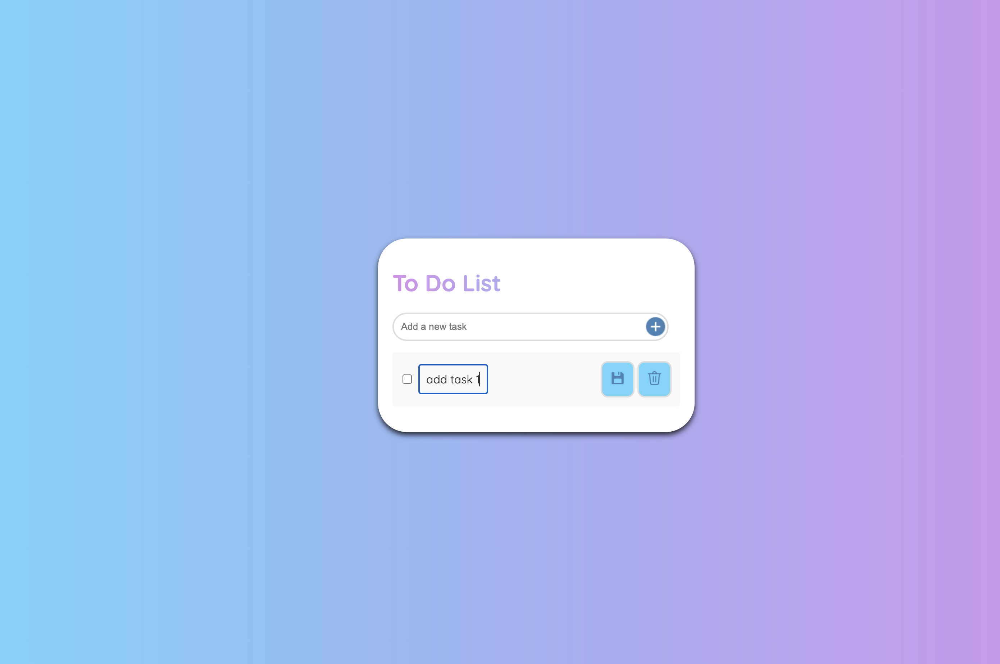

# To Do List App

## Description

This is a simple to do list app that allows users to view, add, delete and edit tasks on their to do list
It is built using HTML, CSS, and Javascript.

## How to Use the Project

1. From the app landing page the user can add tasks to their list using the input field and add button displayed

   

2. Once a task has been added it can be deleted or edited using the apporpriate buttons

   

3. The task can be edited in-situ and resaved using the save button
4. 

## Future Improvements

Future improvements to the app could include:

- add filtering functionality to filter tasks based on e.g. completed/incomplete.
- adding date/time added to allow sorting of tasks oldest to newest.
- adding local storage or database stoarge functionality to allow the task list to be stored.
- allow user to assign priority to tasks and sort/filter based on this.
- add progress tracker.
- add subtasks within a task, so that it can be broken down into smaller parts.
